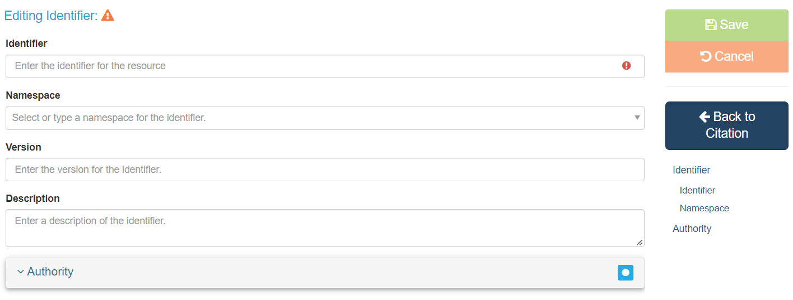

# Creating Profiles for mdEditor
The full profile outline (full-profile-outline.json) provides the full set of fields and sections used in creating profile definitions for the metadata creation program, mdEditor.

Changing the file so that a field is set to "false" will hide that field. Fields that are set to "true" will be displayed. All fields are set to "true" by default, so omitting them from the file will result in the omitted field being displayed. You can set a section to "false" rather than turning off every field individually to remove entire sections.

## Known Issues
Removing certain fields will remove the field, but not the field name. This seems to occur mostly in sections where multiple fields are displayed on one line.

## Identifiers
mdEditor uses three separate field names to represent identifier sections: "identifier", "identifierSimple", and "identifierShort".

identifierShort is the most obvious difference. It displays fewer fields than identifier or identifierSimple: just Identifier, Namespace, Version, and Description.

Identifier and identifierSimple both show all of the identifier fields (all listed above + authority), but change how mdEditor actually displays them. identifierSimple shows the identifier subsection as a pop-up window.

identifier brings you to a separate page to fill out the subsection.

This full profile outline sets all three types of identifier sections to "true", resulting in three identifier sections when using this profile definition.

In nearly every instance where there is a choice between the three options, identifier will be the default (exceptions include: Taxonomy/Taxonomic System/Citation/Identifier and Documents/Identifier which both have identifierSimple as the default). The default identifier option must be set to "false" when using another identifier style, or both types of identifier options will be shown.
